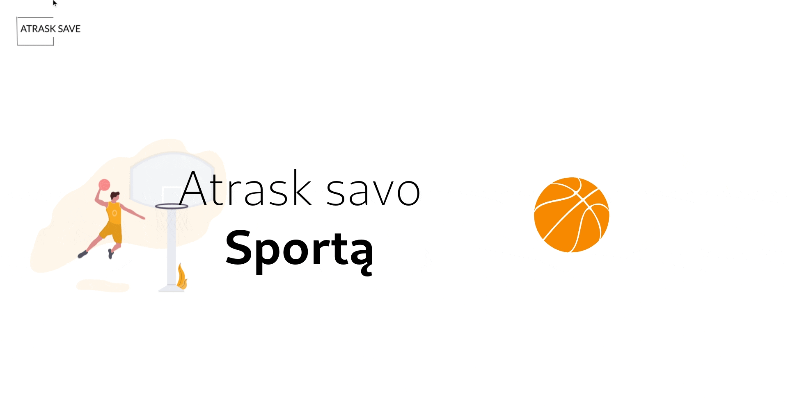

# Atrask Save :runner: :swimmer:

| Table Of Contents | link       |
| ----------------- | ---------- |
| About             | [here](#1) |
| Dev roadmap       | [here](#2) |
| Available Scripts | [here](#3) |

## About 🔠

This application is made to provide its users a convenient way to find new ways of exercising and being active.

## Development roadmap :golf: 

- [x] Create a prototype
- [x] Create a live version using gh-pages
- [x] Create general Sport component
- [x] Create few extra pages
- [x] Improve search form
- [x] Write unit tests
- [x] Complete Readme
- [ ] Create mobile (responsive) version

## Available Scripts 🛠️ 

| Script        | Description                  |
| ------------- | ---------------------------- |
| `yarn start`  | Runs app in development mode |
| `yarn test`   | Launches the test runner     |
| `yarn build`  | Builds app for production    |
| `yarn deploy` | Deploys app using gh-pages   |
| `yarn format` | Format code ussing Prettier  |
